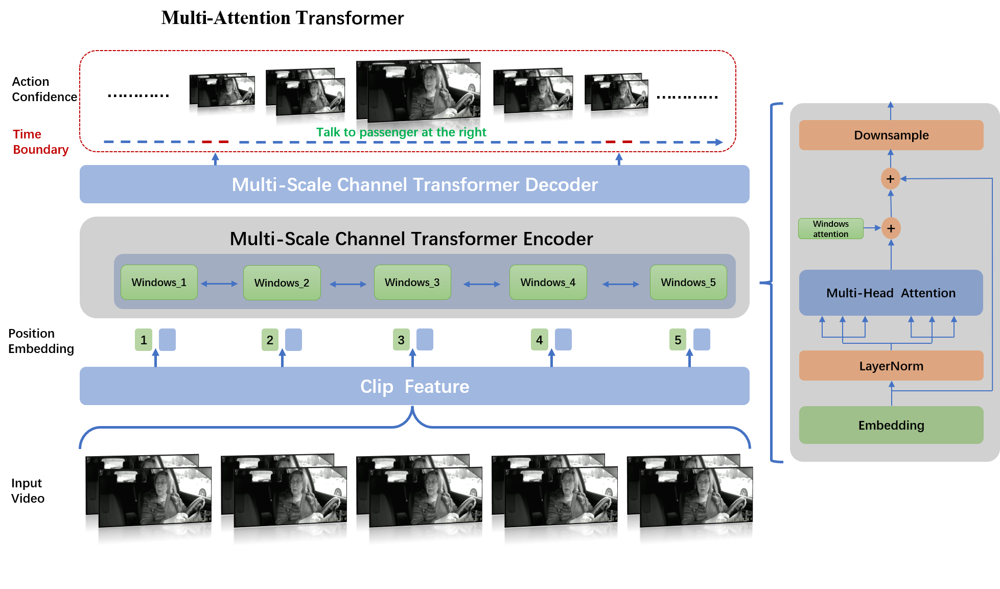

# AIcity_Track3-action_detection_code

# Archi

 

The implementation of our code  for the Track 3 of AI City Challenge.

# Installation  
## For MA-Actionformer
>> 1.Follow requirements.txt for installing necessary dependencies and compiling the code. or just run:   
>>```shell
>>cd MA-Actionformer  
>>pip install -r requirements.txt 
>>```   
>>2.Install NMS 
>>```shell
>>cd ./libs/utils  
>>python setup.py install   
>>cd ../..
>>```   


## For Tridet
>>Please follow the steps from this link [Tridet](https://github.com/dingfengshi/TriDet)


# 1.To Reproduce Our Results on FH(k400)(1280)

## Download Features and Annotations 
>> 1.Download features ** FH(k400)(1280) A2 ** from [this Google Drive link](https://drive.google.com/drive/folders/1daSXHjpe2wblt1j0GCmK5hhoWvBu-QBo?usp=sharing)    
>> 2.Download annotations ** inference: track3_only_Rearview_A1-train_A2-val-nullAnno.json ** and ** Training: track3_Rearview-Dashboard_A1-Alltraining.json ** from [this Google Drive link](https://drive.google.com/drive/folders/1p7mew6x_UUASeJcOXaLlfv3MgF6idfOS?usp=sharing).    
>> 3.Download ** ckpt FH(k400)(1280) **  from [this Google Drive link](https://drive.google.com/drive/folders/1WWqnzr87IhPS1JQRh9EfNsxG6EVWuplR?usp=sharing).    


# 2.To Reproduce Our Results on FL(ego)(1024)    

## Download Features and Annotations     
>> 1.Download features ** FL(ego)(1024) A2 ** from [this Google Drive link](https://drive.google.com/drive/folders/1A3jVJXAwbYXKRSPrmTQ7Y5zMNAnhBTud?usp=sharing)        
>> 2.Download annotations ** inference: track3_only_Rearview_A1-train_A2-val-nullAnno.json ** and ** Training: track3_Rearview-Dashboard_A1-Alltraining.json ** from [this Google Drive link](https://drive.google.com/drive/folders/1p7mew6x_UUASeJcOXaLlfv3MgF6idfOS?usp=sharing).       
>> 3.Download ** ckpt FL(ego)(1024) **  from [this Google Drive link](https://drive.google.com/drive/folders/13-3o7jh0lJ-siVDTP9M_UUc3Wg_lqfbR?usp=sharing).     


# 3.To Reproduce Our Results on FL(hybrid)(1024)    

## Download Features and Annotations     
>> 1.Download features ** FL(hybrid)(1024) A2 ** from [this Google Drive link](https://drive.google.com/drive/folders/11zl4nRBo81hptJxZkPEzIrLzCKMRzPzx?usp=sharing)        
>> 2.Download annotations ** inference: track3_only_Rearview_A1-train_A2-val-nullAnno.json ** and ** Training: track3_Rearview-Dashboard_A1-Alltraining.json ** from [this Google Drive link](https://drive.google.com/drive/folders/1p7mew6x_UUASeJcOXaLlfv3MgF6idfOShttps://drive.google.com/drive/folders/1p7mew6x_UUASeJcOXaLlfv3MgF6idfOS?usp=sharing).       
>> 3.Download ** ckpt FL(hybrid)(1024) **  from [this Google Drive link](https://drive.google.com/drive/folders/1WWqnzr87IhPS1JQRh9EfNsxG6EVWuplR?usp=sharing).    

# 4.To Reproduce Results on FL(hybrid)(1024) with Tridet

## Download Features and Annotations     
>> 1.Download features ** FL(hybrid)(1024) A2 ** from [this Google Drive link](https://drive.google.com/drive/folders/1daSXHjpe2wblt1j0GCmK5hhoWvBu-QBo?usp=sharing)        
>> 2.Download annotations ** Training and inference: track3_only_Rearview_A1-train_A2-val-nullAnno.json ** from [this Google Drive link](https://drive.google.com/drive/folders/1p7mew6x_UUASeJcOXaLlfv3MgF6idfOS?usp=sharing).       
>> 3.Download ** ckpt FL(hybrid)(1024) **  from [this Google Drive link](https://drive.google.com/drive/folders/1_4SMi01Lpa1jo9ZN5DCMpEYlUTDGdK2F?usp=sharing).  

## 5.Unpack Features and Annotations  
>> Unpack the file under **./data** (or elsewhere and link to **./data**).     
>>* The folder structure should look like   
>>```
>>This folder
>>│   README.md
>>│   ...  
>>│
>>└───data/
>>│    └───FH_1280_A2_features/
>>│    │	 └───annotations
>>│    │	 └───features   
>>│    └───...
>>|
>>└───libs
>>│
>>│   ...
>>```   

## 6. Training and Inference  
>> a. Train our MActionFormer with our features on Rear + Dashboard views. This will create an experiment folder under **./ckpt** that stores training config, logs, and checkpoints. Before that, Please modify the annotation file and features path in the yaml file. As for **Tridet**, same as Same as you.
>>```shell  
>>python ./train.py ./configs/aicity_action_xxx.yaml --output reproduce   
>>```   
>>where:    
>>>>  aicity_action_xxx.yaml is the model's archi type file. As for MA-Actionformer, The options include **aicity_action_ego.yaml**,    **aicity_action_hybird.yaml** and  **aicity_action_k400.yaml**.    
>>
>>* [Optional] Monitor the training using TensorBoard   
>>```shell  
>>tensorboard --logdir=./ckpt/aicity_action_xxx_reproduce/logs      
>>```   


>> b. Inference the trained model on Rear views and generate the csv results.    
>>```shell      
>>python ./eval.py ./configs/aicity_action_xxx.yaml ./ckpt/aicity_action_xxx_reproduce/    
>>```     

>> c. ** To get the results of track3 leaderboard you need to change the aicity_action_xxx.yaml type.** 
>> cd ./MA-Actionformer     
>>```shell      
>>python ./eval.py ./configs/aicity_action_k400.yaml ./ckpt/aicity_action_vmae_vitHK400_3modelAIcityA1_1280_crop_rear_A1-train_A2-infe        
>>python ./eval.py ./configs/aicity_action_ego.yaml ./ckpt/aicity_action_ego4d_verb_vitl_track3_crop_pred_rear_A1-train_A2-infe     
>>python ./eval.py ./configs/aicity_action_hybird.yaml ./ckpt/aicity_action_hybrid_k700_vitl_track3_crop_pred_e35_A1-train_A2-infe    
>>```       
>>After the above steps in MA-Actionformer dir are completed, three csv results will be generated for the next step.** The expected score should be around 66.34(%) as in Table 7 of our main paper.**  


>>cd ./tridet       
>>```shell      
>>python ./eval.py ./configs/aicity_action.yaml ./ckpt/aicity_videomae_vitHK400_3modelAIcityA1_1280+16_personOnly_A1-train_A2-infe_tridet     
>>```          
>>After the above steps in Tridet dir are commpleted, one csv results will be generated for the next step.** The expected score should be around 67.23(%) as in Table 7 of our main paper. **       


 


## Contact  

>>{dongxd1, wud21, wangj75, cuis2}@chinatelecom.cn      
>>19120454@bjtu.edu.cn      


